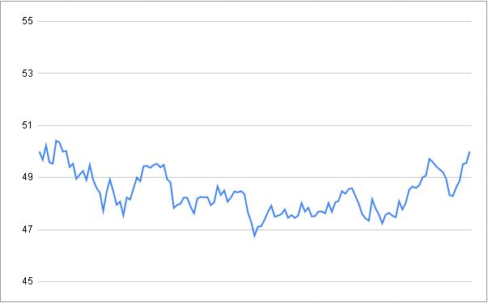
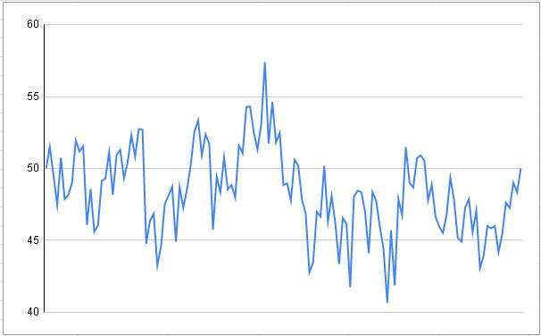

# Perlin Noise and Midpoint Displacement Algorithms

## Overview

Streams of floats using random number generators do not represent real-life situations (e.g. a stock price during market
hours). The purpose of this application is to use recognised algorithms to create a set of points that are more
representative of real-life situations. The consumer of the application can even specify the volatility of the
movements.

For example (100 points with a seed of 50.0):
 
*Stable*
 

 
*Abnormal*
 

## Technical

A gRPC server that serves a stream of timestamped floats (aka points) given the following inputs:

* The algorithm to use
  * MIDPOINT_DISPLACEMENT
  * PERLIN_NOISE
* The volatility (STABLE, NORMAL, ABNORMAL)
  * Volatility refers to how severe the peaks and troughs are in the data
* The number of points to receive
* The seed (i.e. the starting value)

The server implementation is in Java and the client is also in Java although since this is proto, any applicable client
can be used.

